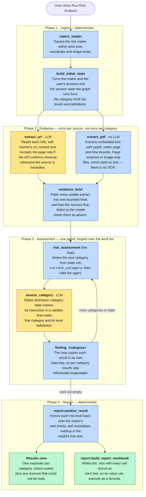

# Agent Architecture

What happens after a user clicks **Run Risk Analysis**.

The backend is a Google ADK 2.0 dynamic workflow. A single orchestrator node,
`risk_assessment`, drives the run in ordinary Python control flow, invoking each
child node via `ctx.run_node()`.

The graph is **static**: it is the same shape whether the risk matrix has three
rows or fifty. Everything that varies per assessment — the categories, their
level descriptions, the project details, the evidence — lives in session state,
and the orchestrator loops over it. There is one assessment agent, called once
per category, not one agent per category.

Only two node types call a model: `extract_url` and `assess_category`.
Everything else is deterministic Python, which keeps a run affordable on a
free-tier key and keeps the parts that must be reliable out of the model's hands.

Yellow nodes call a model. Blue nodes are deterministic Python. Green nodes are
what the user receives.

## The agents

| Agent | Type | What it does |
|---|---|---|
| `risk_assessment` | Orchestrator | Drives the whole run. Reads the category work list from session state, paces every model call against the free-tier quota, and emits the progress the UI shows. |
| `extract_url` | Function node, calls a model | Reads one URL. Accepts the content only when the API confirms the page was actually retrieved; a page that could not be read is excluded rather than answered from the model's prior knowledge. |
| `extract_pdf` | Function node, no model | Reads one PDF's embedded text locally, so it costs no quota. Reports files that yield too little text to be useful. |
| `assess_category` | LLM agent | Rates one risk category against the evidence brief and the project details. Returns a structured result whose risk level is constrained to the matrix's own levels. |

## Why one agent instead of one per category

`assess_category`'s instruction is a callable rather than a fixed string. ADK
invokes it before each request with a read-only view of session state, so the
loop can set `current_category` and the same agent rates whatever it finds
there. A custom matrix with different categories needs no change to the graph.

This is also what lets `agent.py` expose a module-level `root_agent` for
`adk run` and `adk web` to discover. A graph generated per matrix could not be
one, because it would not exist until a matrix had been uploaded.

Per-category results are not lost to the sharing: the agent has a single
`output_key` that each iteration overwrites, and the loop copies every result
into its own `finding_<category>` state key.

## Why the phases are split

Each assessment reads the **evidence brief**, never the raw sources. With nine
categories and up to ten sources, re-reading per category would mean up to
ninety retrieval calls per run. Extracting once holds a run to roughly
`URLs + categories` model calls — about eleven for the shipped matrix — which is
what makes it viable on a free-tier key.

## Failure handling

Each node catches its own errors, because a node that raises aborts the whole
ADK run. A category that fails becomes a single error row and the remaining
categories still run.

The exception is the free-tier **daily** quota. That does not clear while a run
is in progress, so the run stops, says so plainly, and marks the remaining
categories "Not assessed" rather than producing an identical error for each one.

## How the report is produced

Nothing the model returns reaches the user unchecked. Every finding passes
through `report.sanitize_result`, which forces the risk level back onto the
matrix's own levels — anything else becomes `Unknown` — and neutralises markup
in the free-text fields so they cannot render as links or images.

The workbook is then written with every cell stored as inert text, so a value
beginning with `=` is never evaluated as a formula by the spreadsheet client.
Both controls are load-bearing: the structured output schema constrains only the
risk level, and the reasoning and mitigation fields remain free text that a
prompt injection in a matrix cell, a vendor page, or a PDF can still influence.
